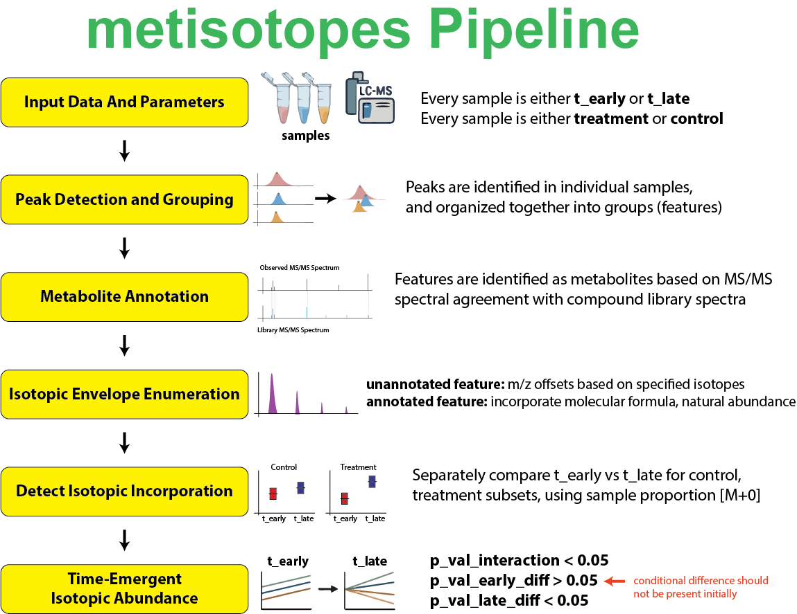

# metisotopes
mass spectrometry utility functions and processing algorithms for analysis of stable isotope label metabolomics data. 


# Installation
Execute the following command in an R console:
```
remotes::install_github("calico/metisotopes", force=TRUE, build_vignettes=TRUE, upgrade="never")
```
# Version Changelog

- **1.0.0** initial public release

# Functions
- **compute_diff_scores**: Computes differential isotope scores comparing control and treatment subsets.
- **compute_isotopic_incorporation**: Determines peak groups with isotopic incorporation by comparing early vs late time points.
- **compute_time_emergent_diff_linear_model**: Applies linear modeling to identify time-emergent differential abundance patterns.
- **diff_iso_all_isotopes_WelchTTest**: Applies Welch's T-test to compare isotopic abundances between two conditions.
- **diff_iso_all_isotopes_WelchTTest_subset**: Applies Welch's T-test to compare isotopic abundances with sample subsetting by regex filters.
- **diff_iso_color_samples**: Colors and re-orders samples based on labeled/unlabeled status.
- **diff_iso_conditions_rescore_and_label**: Re-scores for isotopic incorporation and tests for differential abundance by experimental conditions.
- **diff_iso_emergent_significance**: Tests for time-emergent differential abundance using interaction terms in linear models.
- **diff_iso_m_plus_zero_fraction_WelchTTest**: Identifies isotopic incorporation by comparing M+0 fractions via Welch's T-test.
- **diff_iso_rescore**: Re-scores peak groups based on differential isotopic abundance between sample sets.
- **diff_iso_rescore_and_label**: Re-scores and labels peak groups for isotopic incorporation.
- **get_precomputed_iso_df**: Extracts pre-computed isotopes from mzrollDB as a long-format table.
- **import_isotope_mzroll**: Generates a romic triple_omic object from an isotopes mzrollDB file.
- **label_isotopes_by_top_hits**: Labels peak groups in mzrollDB based on significant isotopic incorporation and differential abundance.
- **PDB_peakgroups**: Extracts the peakgroups table from an mzrollDB file.
- **PDB_peaks**: Extracts the peaks table from an mzrollDB file.
- **PDB_sample_list**: Extracts the samples table from an mzrollDB file.
- **peakdetector_add_CL_argument**: Adds a single command line parameter to peakdetector arguments string.
- **peakdetector_add_params**: Formats and adds multiple parameters to peakdetector command line.
- **peakdetector_add_rt_file**: Adds RT alignment file information to peakdetector command line.
- **peakdetector_add_samples**: Adds sample files to peakdetector command line.
- **peakdetector_command_line**: Generates a complete peakdetector command line for execution.
- **peakdetector_default_isotope_parameters**: Returns default isotope search parameters for peakdetector.
- **peakdetector_default_parameters**: Returns default search parameters for peakdetector.
- **peakdetector_metabolite_search_params**: Generates metabolomics-specific search parameters.
- **pipeline_diff_iso_conditions_search**: Full pipeline for differential isotope analysis with experimental design.
- **pipeline_diff_iso_search**: Full pipeline for differential isotope analysis between labeled and unlabeled samples.
- **pipeline_time_emergent_differential_abundance**: Full pipeline for time-emergent differential abundance analysis with isotopic incorporation.
- **requantify_to_envelope_sum**: Re-quantifies peak groups by summing isotopic envelope intensities.
- **to_emergent_isotope_design_matrix**: Generates design matrix for linear modeling of time-emergent isotopic incorporation.
- **to_iso_matrices**: Converts long-format isotope DataFrame to list of isotope matrices.
- **to_M0_normalized_isotope_matrix**: Normalizes isotope matrix values by dividing by M+0 isotope abundance.
